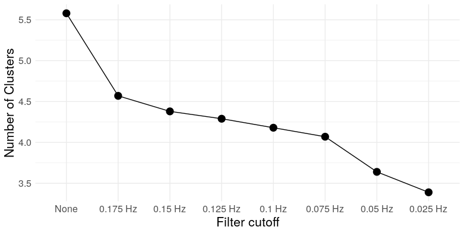

```{r opts, echo = FALSE}
knitr::opts_chunk$set(
  fig.path = "img/"
)
library(ggplot2)
mar <- c(2,2,2,2)
```

<strong>EDIT (Feb 26, 2019):</strong> So it turns out I'm not the first to notice this. Jaroslav Hlinka et al. identified this problem as early as 2012. They even attribute it to the same cause: the (partial) transitivity of the sample correlation. 

<blockquote>
The small-world properties of fMRI functional connectivity graphs obtained using standard methods have been shown to be largely reproduced or even exceeded by a matching randomly connected multivariate autoregressive process. This result shows for the first time that the small-world  properties  of  functional  connectivity real-world graphs can be indeed attributed to the transitive properties of the correlation coefficient, as previously conjectured.</blockquote>

They go on to conclude

<blockquote>Our results suggest that most, if not all, of the observed effect in the brain data is attributable to the small-world bias of the correlation matrix</blockquote>

It's certainly disappointing that no one in the network neuroscience community has felt the need to acknowledge this fact, even though several of them have published in this same journal.

<p style="margin-left: .5in; text-indent: -.5in;">Hlinka, J., Hartman, D., & Paluš, M. (2012). Small-world topology of functional connectivity in randomly connected dynamical systems. Chaos: An Interdisciplinary Journal of Nonlinear Science, 22(3), 033107.</p>

<p style="margin-left: .5in; text-indent: -.5in;">Hlinka, J., Hartman, D., Jajcay, N., Tomeček, D., Tintěra, J., & Paluš, M. (2017). Small-world bias of correlation networks: From brain to climate. Chaos: An Interdisciplinary Journal of Nonlinear Science, 27(3), 035812.</p>

------------------------------------------------------------------------

<strong>Original post:</strong>

Mehler and Kording (2018) just put out a very nice paper on the very flimsy theoretical foundations of network neuroscience, the general impossibility of inferring causal dynamics, or even connectivity itself, from standard approaches to brain connectivity analysis, and the inability to accurately recover the underlying network structure. Riffing on this idea, I want to point out one specific example where properties of networks constructed from neuroimaging data don't necessarily reflect any real property of the underlying brain circuitry. 

Graph theoretic approaches to the analysis of functional brain connectivity use recorded brain activity (most commonly, BOLD fMRI) during resting state or task to construct graphs representing (supposedly) functional connectivity between distinct brain regions. These graphs are often claimed to possess some kind of modular structure -- roughly, a clustered organization in which nodes are densely connected within clusters, and relatively sparsely connected between them. This is usually considered to be a special or noteworthy feature of biological networks, as "random graphs" don't generally display this kind of modularity. More importantly, the modularity observed in functional brain networks is usually assumed to reflect some underlying organization or structure within the brain -- that is, the organization of the brain into distinct functional modules. It's this second view that I take issue with. Below, I'll show how the techniques used to estimate functional brain networks can easily <i>engineer</i> highly modular networks, even when all nodes in the network are completely independent. It follows that the mere appearance of modularity in empirical brain networks is not, in and of itself, evidence for any particular modular organization within the brain.

Suppose that we record mean BOLD signals from a set of brain regions during the performance of a cognitive task. We then apply a standard fMRI preprocessing pipeline, band-pass filter the data within a frequency range commonly associated with cognitive performance, compute the pairwise correlations between regions, and then threshold the correlation matrix to obtain a graph. We compute a few summary statistics for the graph and find that it has substantial structure compared to a null model -- a random graph in which vertices are joined by an edge independently at random. Do we then have evidence that these brain regions are communicating with each other, or exhibit some kind of large scale network structure?

Here's the tricky part: What we <i>meant</i> by our null model is a network in which there are no true relationships between brain regions. What we <i>actually specified</i> was a random graph. The problem is that the two are not the same -- standard approaches to preprocessing fMRI data and constructing functional networks can <i>introduce</i> spurious structure into the graph, even when the underlying signals are independent. 

Let's simulate some data: We'll generate 250 datasets consisting of $N = 150$ white noise signals of length $T = 100$. FMRI data are typically low pass filtered, and functional connectivity analyses are usually carried out in frequency ranges roughly between .025 Hz and .15 Hz, so we'll low-pass filter the data with a cutoff between .025 Hz and .175 Hz, in steps of .025. For each of these cutoffs, we'll construct graphs by thresholding the matrices of pairwise correlations between signals.

What kind of structure can we expect to see, keeping in mind that our signals are pure, uncorrelated white noise? To start with, let's get a sense of what the correlations actually look like. For each filter cutoff, I've plotted the distribution of the Pearson correlation coefficient below:

```{r echo=FALSE, out.width='70%'}
knitr::include_graphics('img/fig1.png')
```

Notice the increased variance and, ultimately, clustering at the boundaries, at lower frequencies. This is completely intuitive: consider the limiting case, when the smoothing is so severe that the signals are essentially linear over their recorded length. In that case, any two either increase/decrease together (a perfect correlation); one increases while another decreases (perfect anti-correlation); or one or both of the signals are zero (zero correlation). So the correlation is effectively binarized in the limit. 

As a digression, this has practical consequences for researchers who misuse significance tests. What is a "significant" correlation? Using a standard t-test, the test statistic for a correlation $r$ is
\[ t = r \sqrt{\frac{n-2}{1-r^2}} \]
which has a $t_{n-2}$ distribution under the null hypothesis of zero correlation under the assumption that the $n$ observations are independent and bivariate normal. But smoothing (or low-pass filtering in general) introduces autocorrelation, which makes larger correlations more common, which inflates the false positive rate of the test. See below for the error rate for a significance threshold of $\alpha = .05$:

```{r echo=FALSE, out.width='70%'}
knitr::include_graphics('img/fig2.png')
```

So for a filter cutoff of .175 Hz (in the ballpark of commonly used cutoffs in the fMRI literature), a t-test with a nominal type I error rate of .05 has an actual error rate of over .2 -- over four times higher. See Lazic (2010) for other examples of scientists not understanding dependence.

This clustering towards the boundaries actually has interesting implications for the structure of thresholded correlation networks. Now, correlation is not transitive in general -- if $X$ and $Y$ are positively correlated, and $Y$ and $Z$ are positively correlated, it is not necessarily the case that $X$ and $Z$ are also positively correlated. But there's a limit -- because covariance is an inner-product, a little linear algebra gives us
\[ r_{XZ} \geq r_{XY}r_{YZ} - \sqrt{1-r_{XY}^2}\sqrt{1-r_{YZ}^2}. \]
If both $r_{XY}$ and $r_{YZ}$ are at least $\theta$, then this implies $r_{XZ} \geq 2\theta^2-1$. In other words, <i>sufficiently extreme</i> correlations exhibit transitivity. What does transitivity mean in the context of a graph? It means triangles. So two things happen here: The clustering of the correlation coefficient towards the boundaries at lower filter cutoffs increases the prevalence of triangles in the resulting correlation network, and the process of thresholding -- removing <i>lower</i> correlations -- selectively kills those edges <i>least</i> likely to be part of a triangle. We can see this through simulation: here are the mean number of triangles for the correlation networks constructed for each filter cutoff (thresholded at 30% edge density, as advocated by Zhang, et al., 2016).

```{r echo=FALSE, out.width='70%'}
knitr::include_graphics('img/fig3.png')
```

At the most extreme cutoff, we have over twice as many triangles <i> for the same edge density</i>. What does this mean for the graph topology? It means clustering. We can take a look at a few measures: Louvain modularity, the clustering coefficient, Humphries' (2008) measure of small worldness, and the number of clusters (as detected by Louvain clustering)

```{r echo=FALSE, out.width='70%'}
knitr::include_graphics('img/fig4.png')
```

```{r echo=FALSE, out.width='70%'}
knitr::include_graphics('img/fig5.png')
```

```{r echo=FALSE, out.width='70%'}
knitr::include_graphics('img/fig6.png')
```

```{r echo=FALSE, out.width='70%'}

```

So we see that, at low frequencies, correlation networks constructed from uncorrelated white noise exhibit: A) substantial modularity; B) substantial clustering; C) "small-worldness"; and D) a relatively small number of clusters. In other words, they look exactly like functional brain networks. 

Of course, "substantial modularity" (for example) is only substantial relative to a null model -- commonly chosen to be something like an Erdos-Renyi random graph, in which pairs of vertices are joined independently at random, or a Newman–Girvan null model, which preserves the expected degree of each node Both of these null models are arguably scientifically uninteresting, as when edges represent correlations (or other measures which behave like inner-products; i.e. kernels), edges cannot be added or removed independently due to the correlation's (partial) transitivity. This means that correlation graphs constructed from random noise are not <i>random graphs</i> in the Erdos-Renyi or Newman-Girvan sense -- they have more structure. Tests against these null models don't necessarily provide the information we want, which is whether an observed correlation network exhibits modularity beyond the substantial modularity already intrinsic to correlation networks constructed from autocorrelated time series,

Of course, none of this is to say that all reported functional connectivity analyses are spurious -- many authors have successfully used functional connectivity estimates to do prediction, for example -- but published claims that fMRI correlation networks exhibit "modular structure" are much less impressive when similar degrees of modularity can obtained from filtered white noise. 

<h3>References</h3>
<p style="margin-left: .5in; text-indent: -.5in;">Humphries, M. D., & Gurney, K. (2008). Network ‘small-world-ness’: a quantitative method for determining canonical network equivalence. PloS one, 3(4), e0002051.</p>

<p style="margin-left: .5in; text-indent: -.5in;">Lazic, S. E. (2010). The problem of pseudoreplication in neuroscientific studies: is it affecting your analysis?. BMC neuroscience, 11(1), 5.</p>

<p style="margin-left: .5in; text-indent: -.5in;">Mehler, D. M. A., & Kording, K. P. (2018). The lure of causal statements: Rampant mis-inference of causality in estimated connectivity. arXiv preprint arXiv:1812.03363.</p>

<p style="margin-left: .5in; text-indent: -.5in;">Zhang, Z., Telesford, Q. K., Giusti, C., Lim, K. O., & Bassett, D. S. (2016). Choosing wavelet methods, filters, and lengths for functional brain network construction. PloS one, 11(6), e0157243.</p>