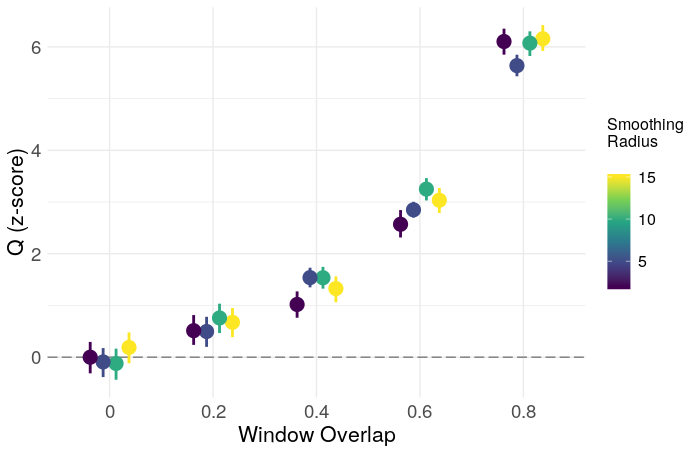
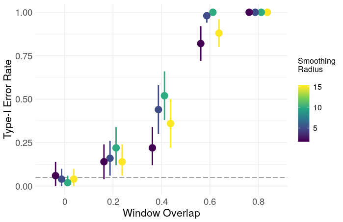

```{r opts, echo = FALSE}
knitr::opts_chunk$set(
  fig.path = "img/"
)
library(ggplot2)
mar <- c(2,2,2,2)
```

Network neuroscience (NN) as a field lacks statistical and theoretical justification for almost any of it's techniques. The discipline consists largely of ad hoc measures whose statistical properties are very poorly understood and whose relationships to brain function (if they exist at all) have not been clearly established. Much of this stems from a lack of domain knowledge -- network neuroscience is a very young field -- but a part of it comes from a lack of methodological rigour in general. Most techniques in NN have been imported from other fields (esp. social network analysis), and the most influential papers read like the appendix to an introductory graph theory textbook, with the authors computing every graph property they can think of with no attempt to establish the meaning of the property with respect to the brain, or even whether the property can be reliably estimated from a sample at all (i.e. the field lacks a statistical framework in general.)

Dynamic networks are particularly tricky, as much of the field has been developed in the context of resting-state brain activity, where there are no exogenous variables that can be used to model the network dynamics. This has led -- very broadly -- to two principal approaches to the study of dynamic connectivity: 1) What I'll call the "modeling" approach, exemplified by something like the markov switching factor models of e.g. Taghia et al. (2017), and 2) the "descriptive" approach, exemplified by authors like Bassett et al. (2011, 2013) and Betzel et al. (2013), which analyzes descriptive statistics computed from static or dynamic graphs.

The construction of these graphs generally requires a large number of arbitrary preprocessing choices, and there is very little understanding of the ways in which these choices impact the resulting statistics. Much of the existing research is satisfied to compute a network measure and establish it's significance relative to a random graph, which is usually accomplished by some form of permutation testing, since we lack: 1) a sensible null model for the absence of dynamic functional connectivity; 2) an understanding of how this null model changes under various preprocessing decisions; and 3) a null distribution for most of our network measures under (1) and (2). This is far too broad of a subject to unpack in a single post, so I'll tackle a single, specific example.

We often construct temporal networks from resting scans (or any other scan) using temporal sliding windows. Naturally, we observe changes from window to window -- if, for no other reason, than because the data are noisy. We of course want to know whether this temporal structure reflects genuine changes in functional connectivity over time, or if it is explainable by noise alone. Lacking a theoretical null model, one possible approach to conducting this test is through the temporal null model of Bassett, et al. 2013 -- a permutation test in which the modularity (or some other statistic) of the observed network is compared to a null distribution generated by randomly permuting the temporal order of the network slices, in order to "...probe the existence of significant temporal evolution of community structure" (p. 9)

The conceptual null model here is that true dynamic functional connectivity varies smoothly over time. Shuffling the window order destroys this temporal smoothness while preserving other quantities, such as the <i>variance</i> in functional connectivity over the course of the scan. This test is thus insensitive to the overall <i>range</i> of functional connectivity, as this is preserved by temporal shuffling. This is not a failure of the test -- it's just always good to keep in mind exactly what is being tested.

The problem is that several preprocessing decisions can introduce temporal smoothness into the observed network, and this test turns out to be wildly miscalibrated under these settings. I'll focus here on two: the use of overlapping time windows, and the use of low-pass filtering on the BOLD signal (more generally, the presence of autocorrelation). The reason is fairly intuitive -- both of these actions introduce sequential dependence in adjacent networks that is destroyed by time randomization. This sequential dependence creates the appearance of temporal smoothness beyond what would be expected from windows containing independent observations. This is easy to see by simulation.

We construct temporal networks from uncorrelated white noise signals using a sliding window approach. Within each window, we create a weighted graph by thresholding the sample correlation matrix at zero. The community structure of the resulting temporal network is then estimated using the generalized Louvain algorithm implemented in the MATLAB toolbox provided by Lucas et al. (2011-2017). Each iteration is as follows:

<pre>
input: num_sim = 100
       num_roi = 100
       num_timepoint = 300
       window_width = 50
       stepsize = [50 40 30 20 10]
       smooth = [2 5 10 15]
       n_iter = 50 
       n_shuffle = 50
       gamma = 1
       omega = 1

For 1:num_sim

1) Generate a "num_roi" x "num_timepoint" matrix 
   of independent, standard normal random numbers.

2) Low pass filter each time series, with filter
   parameter "smooth"

3) Using a sliding window of length "window_width", 
   moving in steps of "stepsize", calculate a 
   sequence of sample correlation matrices.

4) Set negative correlations to zero.

5) For i = 1:n_iter
   
   5a) Construct a multilayer modularity matrix
       with multiord(..., gamma, omega)

   5b) Estimate community structure with
       iterated_genlouvain(..., moverandw, 
           postprocess_ordinal_multilayer)

   5c) Compute network statistics

6) Compute average statistic over n_iter iterations

7) Repeat (5-6) for "n_shuffle" randomly shuffled
   sequences. 

8) Compute z-statistic for (6)
</pre>

In this case, low-pass filtering is crudely done with a moving average filter of radius <code>smooth</code>. The output of (7) is used as a temporal null distribution to derive a z-statistic for the network. I'll focus here on the modularity (Q), as it is one of the most commonly reported statistics in the literature. The resulting z-scores and type-1 error rates are shown below, plotted as a function of <code>smooth</code> and the proportion of window overlap.

```{r echo=FALSE, out.width='100%'}

```

```{r echo=FALSE, out.width='100%'}

```

Clearly, overlapping windows result in a grossly inflated type-1 error rate, and inflated modularity in general. The effect of smoothing is less clear, and may just need a larger number of iterations for more precision, though a simple ANOVA gives evidence for some effect

<pre>
> fit <- aov(z ~ Smooth * Overlap, data = af)
> summary(fit)
                Df Sum Sq Mean Sq  F value  Pr(>F)    
Smooth           1     11      11    7.620 0.00588 ** 
Overlap          1   4098    4098 2970.096 < 2e-16 ***
Smooth:Overlap   1      0       0    0.295 0.58743    
Residuals      996   1374       1                     
---
Signif. codes:  0 ‘***’ 0.001 ‘**’ 0.01 ‘*’ 0.05 ‘.’ 0.1 ‘ ’ 1
</pre>

The lesson here is that one should be very precise about the quality that is being tested (in this case, temporal smoothness), and either avoid preprocessing which introduces this quality into the data, or construct a test which is insensitive to these preprocessing decisions.

<h3>References</h3>

<p style="margin-left: .5in; text-indent: -.5in;">Bassett, D. S., Porter, M. A., Wymbs, N. F., Grafton, S. T., Carlson, J. M., & Mucha, P. J. (2013). Robust detection of dynamic community structure in networks. Chaos: An Interdisciplinary Journal of Nonlinear Science, 23(1), 013142.</p>

<p style="margin-left: .5in; text-indent: -.5in;">Bassett, D. S., Wymbs, N. F., Porter, M. A., Mucha, P. J., Carlson, J. M., & Grafton, S. T. (2011). Dynamic reconfiguration of human brain networks during learning. Proceedings of the National Academy of Sciences, 108(18), 7641-7646.</p>

<p style="margin-left: .5in; text-indent: -.5in;">Betzel, R. F., Griffa, A., Avena-Koenigsberger, A., Goñi, J., Thiran, J. P., Hagmann, P., & Sporns, O. (2013). Multi-scale community organization of the human structural connectome and its relationship with resting-state functional connectivity. Network Science, 1(3), 353-373.</p>

<p style="margin-left: .5in; text-indent: -.5in;">Lucas G. S. Jeub, Marya Bazzi, Inderjit S. Jutla, and Peter J. Mucha, "A generalized Louvain method for community detection implemented in MATLAB," http://netwiki.amath.unc.edu/GenLouvain (2011-2017). </p>

<p style="margin-left: .5in; text-indent: -.5in;">Taghia, J., Ryali, S., Chen, T., Supekar, K., Cai, W., & Menon, V. (2017). Bayesian switching factor analysis for estimating time-varying functional connectivity in fMRI. NeuroImage, 155, 271-290.</p>