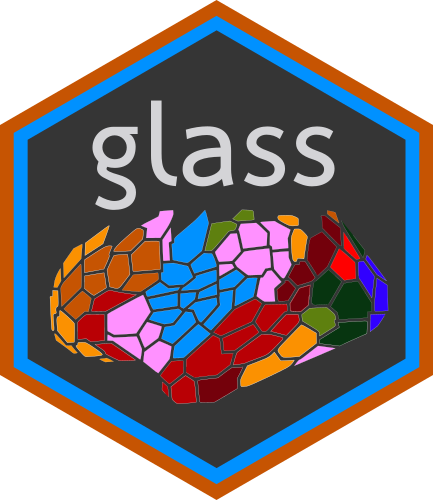

  

## Cortical, cerebellar, and striatal surface maps

  

---

**glass** is a set of wrappers around functions in the ggseg and ggseg3d packages designed to make certain kinds of surface plots simpler by handling some of the necessary data manipulation automatically. The package is in early progress, and is at the moment geared towards the use of the Schaefer parcellation provided by ggsegSchaefer, and also includes some capability for rudimentary cerebellar and striatal flatmaps.

### Installation

**glass** can be installed from GitHub with using `install_git()` from the `devtools` package using the command below:

`devtools::install_git('areshenk-rpackages/glass')`
