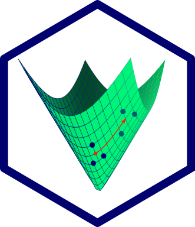

  

## Symmetric, positive definite matrices in R

  

---

**spdm** is an R package implementing operations on symmetric, positive-definite matrices (aka covariance matrices). Besides offering several forms of regularized covariance estimation, **spdm** is focused on geometry-respecting covariance analysis -- that is, operations which respect the intrinsic Riemannian manifold structure of the set of the symmetric positive-definite matrices. In my own work, these techniques are usually applied to the analysis of fMRI functional connectivity.

### Installation

**spdm** can be installed from GitHub with using `install_git()` from the `devtools` package using the command below:

`devtools::install_git('areshenk-rpackages/spdm')`

### Issues

**spdm** is diligently tested, and is under ongoing development. That said, the  package comes equipped with two main caveats:

1. Many of the operations implemented in **spdm** involve the manipulation (commonly, inversion) of large matrices. The sample covariance is often ill-conditioned -- particularly when the sample size is not considerably larger than the dimension -- and inversion can result in the accumulation of large amounts of error. This can be partially mitigated through the use of well-conditioned estimators (such as the Ledoit-Wolf shrinkage estimator), which should almost always be chosen over the sample covariance (for many reasons, numerical and statistical). However, I am not a specialist in numerical linear algebra, and I make no guarantees about the error of any given operation. I am slowly planning more sanity tests to flag these kinds of numerical issues, but have not done so yet.

2. A major use for **spdm** in my own work is in the centering and subject alignment of functional connectivity data via parallel transport. This works wonderfully and is, I'm convinced, an essential part of any analysis of task differences in functional connectivity. There is, however, an interpretational issue, in that the resulting (centered) covariance matrices are distorted by the centering procedure, and the entries correspond to linear combinations of uncentered covariances. This issue is more severe when transporting over larger distances (where the curvature of the space becomes significant), but as of yet there are no formal procedures for actually characterizing this distortion.
