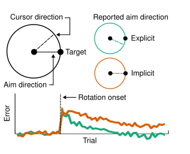
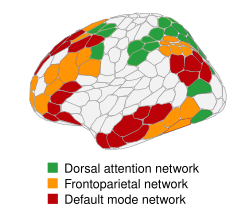
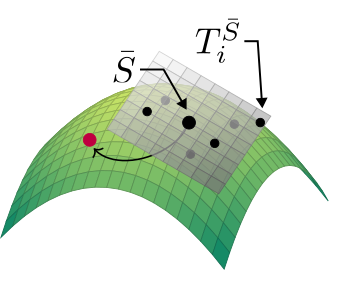

---
cascade:
  headless: false
description: 
show_header: true
sidebar_left: false
title: Research
---

### Explicit processes in sensorimotor learning and control

Learning to interact successfully with the environment requires learning to select an appropriate motor command in order to achieve a desired outcome. Although the brain is capable of accomplishing much of this without conscious effort or attention, Humans can also use conscious, strategic (i.e. *explicit*) processes to augment their learning. Most of my work focuses on the contribution of explicit processes to motor learning and control, and on the brain networks which support these processes. More generally, I am interested in the contributions of distinct processes (e.g. learning from sensory prediction errors, reinforcement learning, episodic memory) to different facets of performance, and in the ways the differential recruitment of these processes contributes to individual differences in learning.

<b>Areshenkoff, C. N.</b>, Gale, D. J., Standage, D., Nashed, J. Y., Flanagan, J. R., & Gallivan, J. P. (2022). Neural excursions from manifold structure explain patterns of learning during human sensorimotor adaptation. Elife, 11, e74591.

<b>Areshenkoff, C. N.</b>, de Brouwer, A. J., Gale, D. J., Nashed, J. Y., & Gallivan, J. (2022). Separate and shared low-dimensional neural architectures for error-based and reinforcement motor learning. bioRxiv, 2022-08.

### Whole-brain functional network structure

I'm especially interested in functional interactions between higher-order, multimodal brain networks (such as the default mode network) and sensorimotor regions. Some of our recent work implicates core nodes of the default mode network, such as the cingulate cortex and medial temporal lobes, in motor learning processes. 

<b>Areshenkoff, C. N.</b>, Nashed, J. Y., Hutchison, R. M., Hutchison, M., Levy, R., Cook, D. J., ... & Gallivan, J. P. (2021). Muting, not fragmentation, of functional brain networks under general anesthesia. Neuroimage, 231, 117830.

### Methods for analyzing whole-brain functional connectivity

The analysis of fMRI functional connectivity typically involves the analysis of very high-dimensional covariance matrices, encoding the BOLD signal covariance between brain regions or voxels. There is considerable evidence that the analysis of the resulting data -- e.g. clustering, dimension reduction, etc -- benefits from statistical methods which respect the natural geometric structure of the space of covariance matrices.

