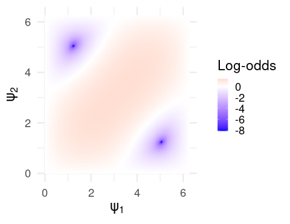

```{r opts, echo = FALSE}
library(kableExtra)
knitr::opts_chunk$set(
  fig.path = "img/"
)
library(ggplot2)
mar <- c(2,2,2,2)
```

It's been more than a few years since I've actually played around with any gambling tasks, and in the intervening time, models of sequential decision making based on concepts from quantum mechanics were briefly in vogue in several journals devoted to decision making and learning. I haven't studied any quantum mechanics in a while, either, so I thought it would be interesting to unpack one of these models: Specifically, the model of Iowa Gambling Task performance reported by @li2020quantum, which claims to find better fits to Human performance than classical models, such as ones based on the delta learning rule.

I admit I'm largely ignorant of most of these models' uses in the literature. There do seem to be cases where quantum and classical models produce measurably different predictions, and in where quantum models appear to explain patterns of preference judgement not captured by classical models [e.g. @epping2023using]; but the cynic in me wonders if a large part of the appeal isn't the quantum language itself, especially as descriptions of these models in the literature tend to bury the reader in notation without providing insight. 

In this case, the problem to solve is a standard Iowa gambling task (IGT), which is just a four-armed bandit disguised as a card game. On each trial, subjects are presented with four decks of cards, and upon choosing one, receives a monetary reward. The rewards associated with each deck are probabilistic, and the subject is told to earn as much money as possible by the end of the task, and must do so by selecting from each deck and learning which of the four is the most profitable.

A standard model for this task looks something like this: The subject maintains a valuation $v = (v_1,v_2,v_3,v_4)$, which encodes something like the expected utility for each deck. Upon choosing a card $i$, the subject receives a payout $x$, which has utility $u(x)$. The subject then updates the valuation for deck $i$ according to some update rule, and chooses another card with probability computed by passing $v$ through a softmax function. Typically, the utility function and update rules depend on subject-specific parameters encoding e.g. learning rate, loss aversion, etc., and these parameters are estimated from subjects' performance in order to draw inference about the subject's decision making strategy [see e.g. @steingroever2013comparison for a taxonomy of similar models].

Now, onto the quantum model. Let's dispense with the quantum mechanical formalism, and especially with the quantum mechanical *notation*, which is needlessly opaque for anyone outside of the field. In finite dimensions (the only case anyone ever actually considers in these applications), nothing happens that can't be more concisely written using standard matrix notation; and so we'll treat this as an ordinary model of sequential decision making with a weird update rule, and we'll use standard linear algebraic notation.

Assume that the subject maintains a valuation $z(t) = (z_1,z_2,z_3,z_4)$ for each deck on trial $t$, where at this point the only notable departure is that $z$ is a vector of complex numbers. After selecting deck $i$, they observe an outcome with utility $u$. The update rule is slightly complex, so we'll proceed in steps. Ultimately, we'll define a matrix $G$ so that the valuation on the next trial is

$$
  z(t+1) = Gz(t),
$$ so that, fundamentally, we're just working with a linear update.

The matrix $G$ (which we'll call the Grover matrix) is decomposed into a pair of matrices $G = U_2U_1$ which depend, respectively, on the chosen deck and on the current valuation $z(t)$. Letting $z$ be the current valuation and letting $a$ be an indicator vector for the chosen deck (i.e. if deck $i$ was chosen, the $i$'th entry is 1, and the rest are zero), they are defined as follows:

\begin{align*}
  U_1 &= I - (1 - e^{i\psi_1})aa^{\top} \\
  U_2 &= (1 - e^{i\psi_2})zz^{\top} - I
\end{align*} where $I$ is the identity matrix.

To be very explicit, for those uncomfortable working with complex numbers, the notation $e^{i\psi_1}$ denotes the complex number $cos(\psi_1) + isin(\psi_1)$, and the transpose $z^\top$ always denotes the *conjugate* transpose (i.e. an entry $a+bi$ becomes $a-bi$). To be even more explicit:

```{r}
ComputeGrover <- function(psi, a, z) {
  ndecks <- length(a)
  I  <- diag(complex(ndecks, real = 1, imaginary = 0))
  e1 <- 1 - complex(modulus = 1, argument = psi[1])
  e2 <- 1 - complex(modulus = 1, argument = psi[2])
  
  U1 <- I - e1 * (a %*% t(Conj(a)))
  U2 <- e2 * (z %*% t(Conj(z))) - I
  
  return(U2 %*% U1)
}
```

The only thing that remains is to define $(\psi_1,\psi_2)$. The authors define the quantities as a function of the utility $u$:

\begin{align*}
  \psi_1 &= \pi (u \cos(\pi \eta) + b_1) \\
  \psi_2 &= \pi (u \sin(\pi \eta) + b_2),
\end{align*} where $(\eta, b_1, b_2)$ are parameters (but see the discussion below). Again, to be explicit:

```{r}
ComputePsi <- function(u, pars) {
  eta <- pars$eta
  b1  <- pars$b1
  b2  <- pars$b2
  psi <- c(pi * (u * cos(pi*eta) + b1),
           pi * (u * sin(pi*eta) + b2))
  return(psi)
}
```

Once we have the updated valuations $z$, the probability of selecting deck $i$ is the squared modulus $|z_i|^2$.

```{r}
ComputeChoiceProbs <- function(z) {
  Mod(z)^2
}
```

Complexity aside, what I want to make clear here is that, however the update rule was derived, ultimately we are just fitting curves to subjects' behavior. In particular, the snippets of code that I've provided will implement this learning rule on your very own, boring, non-quantum computer. Using this model, your stupid classical laptop will succeed in learning a Bandit task like the IGT, even though it has never even seen Oppenheimer and nothing "quantum" is happening in the way your CPU manipulates bits in memory. This is, first and foremost, a flexible curve-fitting algorithm.

### Intuition

Consider the more straightforward update of the delta learning rule, where the subject maintains a valuation $x = (x_1,x_2,x_3,x_4)$ denoting the expected utility of each deck, and updates the valuation of the chosen deck $x_i$ according to

$$
  x_i(t+1) = x_i(t) + k[u - x_i(t)].
$$ 

That is, if the observed utility was higher than expected, we update our expectation upward; and vice versa. The actual *mechanism* underlying the update of our quantum learning rule is much more opaque, but we can get some geometric intuition.

Suppose our current valuation of the four decks is $z(t) = (z_1,z_2,z_3,z_4)$, and so the probability that we choose deck $i$ is $|z_i|^2$. This implies that $\sum_{i=1}^4 |z_i|^2 = 1$, and so $z$ is a unit vector lying on a sphere. The norm $|z_i|$ is just the projection of $z$ onto the $i$-axis, and so the probability that we select this deck is roughly proportional to how much $z$ points in the direction of the corresponding deck.

This is easiest to see in the simple two-dimensional example in the figure below, where we imagine two decks $x$ and $y$, and a (real-valued) valuation $z = (z_1,z_2)$. Here, the (square of the norm of the) projections of $z$ onto the $x$ and $y$-axes determine the probabilities of the respective deck selections.

```{r echo=FALSE, out.width='40%', fig.align="center"}

```

Note that, however we update $z$ after observing the outcome of our selection, the new valuation $z'$ must *also* lie on the sphere, and so can be obtained by applying a rotation to $z$ about the origin. Sensibly, we would like to rotate $z$ to point "more towards" the chosen deck if it payed well. Intuitively, this is a perfectly sensible learning rule.

This is, in fact, precisely what is happening. The matrices $U_1$ and $U_2$ are unitary transformations, and so in particular are simply rotations (and reflections) about the origin. Assuming our axes

\begin{align*}
  a_1 &= (1,0,0,0) \\
  a_2 &= (0,1,0,0) \\
  a_3 &= (0,0,1,0) \\
  a_4 &= (0,0,0,1)
\end{align*} 

correspond to the four respective decks, we would like the result of applying $G = U_2U_1$ to be a rotation/reflection of $z$ to point more parallel to or more orthogonal to the chosen deck, depending on whether the outcome was better or worse than expected, respectively.

Through a rather elaborate derivation, the authors give the ratio $R$ of this change in probability (that is, the ratio of the probability of deck $a$ before and after having observed the outcome with utility $u$):

$$
  R = \left |(1 - e^{i\psi_1} - e^{i\psi_2}) - (1 - e^{i\psi_1})(1 - e^{i\psi_2})|z_a|^2 \right |^2
$$
This closed-form update is especially useful, as it let's us directly visualize some unusual model behavior.

### What does the update look like?

Now, here's the point of this exercise. We'll consider two models in parallel, which we'll call QM (for quantum model) and CM (classical model). Both will use the same utility, but QM will apply the update we've just discussed, while CM will use the delta learning rule along with a softmax function to determine deck selection probabilities.

|                    | CM                                            | QM                       |
|----------------------|:------------------------|:------------------------|
| Valuation          | $\mathbb{R}$-valued                           | $\mathbb{C}$-valued      |
| Update             | $z_i(t+1) = z_i(t) + r[u - z_i(t)]$           | $Gz(t)$                  |
| Selection          | $P(k) = \frac{e^{z_k}}{\sum_{i=1}^4 e^{z_i}}$ | $P(k) = |z_k|^2$         |
| Initial valuations | $z_k = 0$                                     | $z_k = \frac{1}{2} + 0i$ |

This is what we're going to do: We're going to pick deck (say, deck 1) and look at the change in selection probability for that deck as a function of the utility. Specifically, since we have a closed-form expression for this for the QM model, we'll be comparing the log-odds of selecting the deck before and after the outcome, as a function of the model parameters. Here is it for the model CM:

```{r echo=FALSE, out.width='40%', fig.align="center"}
knitr::include_graphics('img/cm_logodds.png')
```

Note that this is completely sensible. As the utility increases, our probability of selecting the deck increases as the utility of the outcome increases, and this effect is greater for higher learning rates $r$.

Now onto the, uh...difficulty of model QM. First things first, we'll ignore the parametrization in terms of $u$, and just focus on the log-odds of selecting the chosen deck as a function of $(\psi_1,\psi_2)$, however they are calculated. Note that, as these are angles, they are periodic with period $2\pi$, and so it suffices to consider only this range.

```{r echo=FALSE, out.width='40%', fig.align="center"}

```

For clarity, the red region corresponds to values of $(\psi_1,\psi_2)$ leading to an increased probability of selecting the chosen deck, and vice versa for the blue. What we *want* to do is define some continuous function $f$ which maps the observed utility (maybe depending on some parameters) to some value of $(\psi_1,\psi_2)$. And we would like to do this in a way that we end up in the red region if the utility is positive, and in the blue region otherwise. Note that we specify *continuous* because would expect similar utilities to result in similar updates. If this function has parameters, we would also like them to be *interpretable*, in the way that $r$ in the delta learning rule can clearly be interpreted as the learning rate.

As the authors point out, the mapping

```{=tex}
\begin{align*}
  \psi_1(u; \eta, b_1, b_2) &= \pi (u \cos(\pi \eta) + b_1) \\
  \psi_2(u; \eta, b_1, b_2) &= \pi (u \sin(\pi \eta) + b_2),
\end{align*}
```
defines a line passing through the point $(b_1,b_2)$, with slope $\tan(\pi \eta)$. Intuitively, the mapping $G$ defines a surface mapping the $(\psi_1,\psi_2)$ to the change in deck selection probability, and $(\psi_1,\psi_2)_{\eta,b_1,b_2}$ maps the observed utility to a one-dimension slice of this space, as depicted below. Note that, despite what the plot below indicates (as I don't have the energy to correct it), the "center" of this line (corresponding to zero utility) is at the point $(\pi b_1, \pi b_2)$.

```{r echo=FALSE, out.width='40%', fig.align="center"}

```

There are two things I dislike about this parametrization as a model for Human behavior. First, the parameters are extremely difficult to interpret, as the relationship between utility and the change in deck probability are very difficult to read from the parameter values themselves. If the user knows the landscape of the function, they can compute the effect of zero utility by looking at whether the update implied by $(\pi b_1, \pi b_2)$ is positive or negative, but the effect of $\eta$ in particular is entirely dependent on the basepoint $(b_1,b_2)$, and can imply opposite things about the effect of increasing utility depending on the specific values.

The second is that, because the log-odds are periodic in $(\psi_1,\psi_2)$, any unbounded function of $u$ (such as this one) will exhibit oscillatory behavior, as shown in the example below:

```{r echo=FALSE, out.width='40%', fig.align="center"}
knitr::include_graphics('img/qm_psiplot_wonkypars.png')
```

We can see this exactly by choosing some specific parameters -- say, $(\eta, b_1, b_2) = (0.1, .9, .7)$. Then, here are the log-odds for different utilities:

```{r echo=FALSE, out.width='70%', fig.align="center"}

```

Actually, we can be more specific. As the update is periodic in both $\psi_1$ and $\psi_1$, the parameter space of $G$ is actually a torus (seen below).

```{r echo=FALSE, out.width='40%', fig.align="center"}

```

The parametrization of the update in terms of ($\eta, b_1, b_2$) means that the change in log-odds is the orbit of a linear flow, which immediately suggests some odd behavior. For one, for any rational $\eta$, the orbit is a closed curve, and so the update is periodic in the observed utility. This means that the model cannot increase its preference for a deck monotonically with the increasing utility: If a small negative utility results in a decrease in deck preference, then a large enough *positive* utility must also result in a decrease in preference. I'm not sure if it's realistic to expect that people learn this way. In fact, the global model behavior seem obviously inconsistent with the way that people actually learn.

I suspect that, for a specific payoff schedule, it would be possible to carefully tailor the parameters so that the log-odds over the range of experienced utility lies in a well behaved region of the space. For example, if the utility experienced by the subject is constrained within $(-.2, .5)$, then the parameters $(\eta, b_1, b_2) = (0.1, 0, .5)$ give a reasonable update:

```{r echo=FALSE, out.width='70%', fig.align="center"}
knitr::include_graphics('img/qm_logodds_example2.png')
```

For these specific values of $(b_1, b_2)$, the parameter $\eta$ is almost interpretable as something like an inverse learning rate:

```{r echo=FALSE, out.width='70%', fig.align="center"}
knitr::include_graphics('img/qm_logodds_example3.png')
```

In fact, we get a pretty close approximation of the curves generated by the CM for different learning rate parameters. But not so for slightly different values $(b_1, b_2) = (-.2, .3)$:

```{r echo=FALSE, out.width='70%', fig.align="center"}

```

Now, $\eta$ is hardly interpretable at all. For positive values, all utilities near zero result in a *decreased* selection probability, while negative values gives an almost-sensible but non-monotonic change in probability. In this sense, the model is *extremely* flexible for a relatively small number of parameters (only one additional parameter compared to something like the PVL-delta), at the cost of the parameters being nearly uninterpretable from a cognitive or behavioral standpoint, arguably negating the primary use of these models in psychology and neuroscience.

When we dispense with the quantum language and view it merely as a model of sequential decision making with a particularly flexible policy update, the structure of the model is quite simple: We have a smooth surface -- a function of $(\psi_1,\psi_2)$ -- and we take a slice of this surface by defining a line in the plane (a function of $\eta$, $b_1$, and $b_2$). This slice gives the change in log-odds of selection as a function of the observed utility. Since the surface is reasonably complex, we can get a wide variety of these probability curves depending on where we place the line; hence the flexibility of the model.

As a model, it's interesting, but since it is fundamentally just curve fitting, and since the weird oscillatory learning behavior is clearly inconsistent with the way decision making is likely to be implemented in the brain, I'm not sure that the model's performance really suggests that the brain is leveraging "quantum" phenomena. Shor's algorithm is a polynomial time quantum algorithm for integer factorization. And yet, we wouldn't claim that the ability of a subject to factor small numbers in their head is evidence for some kind of quantum computation in the brain. Classical algorithms can do prime factorization too. Quantum algorithms are designed to take advantage of the architecture of a quantum computer, but they typically solve the same *problems*. The mere fact that a model based on quantum computation can predict behavior (e.g. the *output* of some computation) does not, by itself, suggest any kind of quantum computation in the brain unless we can also show that something in the computational architecture of the brain is actually quantized.
